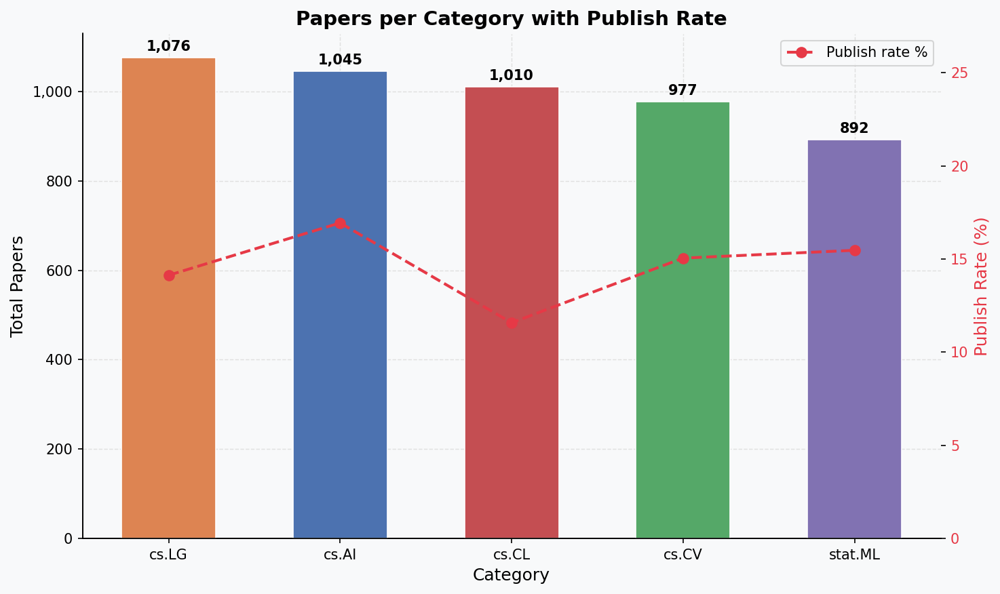
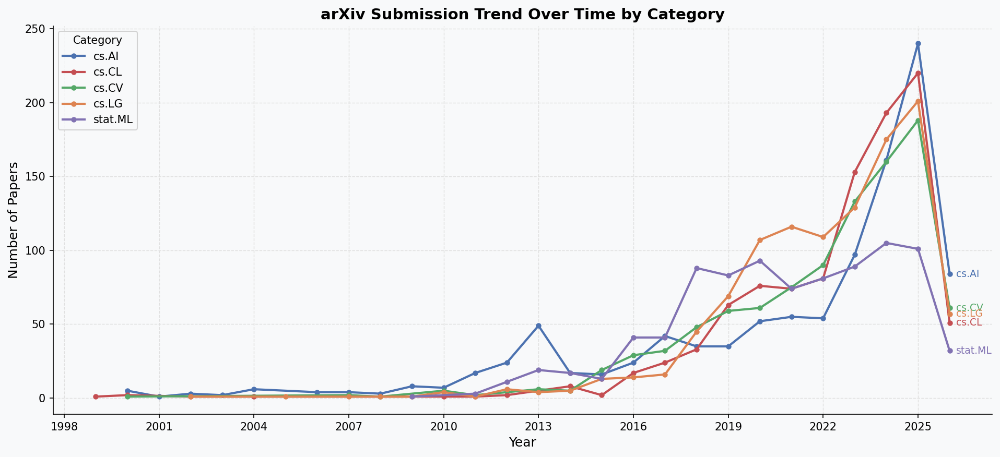
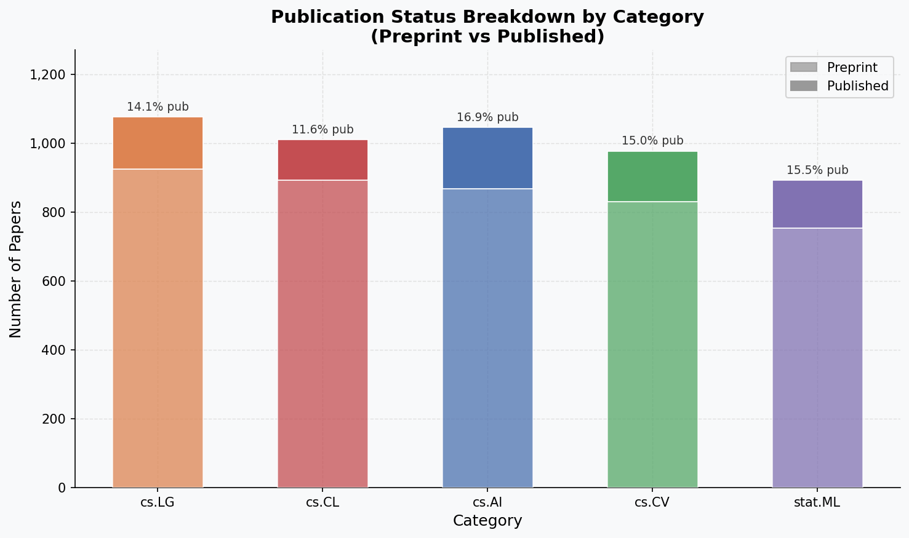
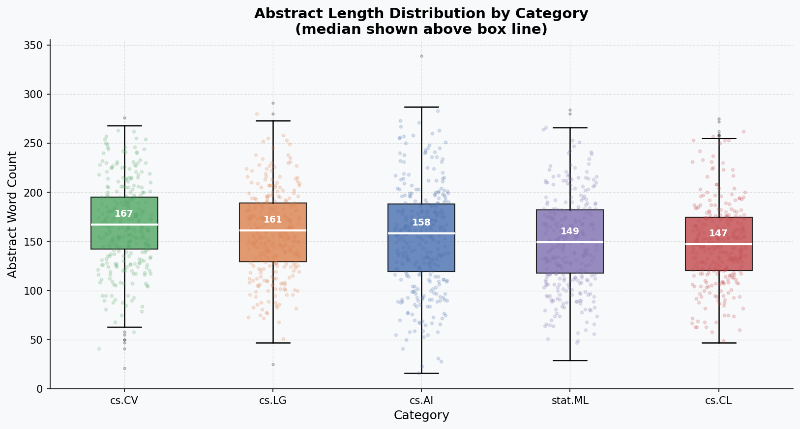

# arXiv Research Intelligence Pipeline

An end-to-end data pipeline over 5,000 arXiv computer-science papers: raw
snapshot → validated SQLite warehouse → analysis charts → a retrieval-augmented
question-answering API.

Built to answer questions that a keyword search can't, such as *"what
regularization methods do cs.LG papers actually use?"* — the answer is generated
from the retrieved abstracts and cites the arXiv IDs it drew on.

```
Kaggle snapshot     ingest       transform      quality       visualize
 (100k records) ──▶  filter  ──▶  5 SQL     ──▶  14 data  ──▶  4 charts
                     sample       tables         checks
                       │
                       └──▶  chunk + embed  ──▶  Chroma  ──▶  FastAPI  ──▶  RAG answers
                             (MiniLM-L6-v2)     vectors      /query       with citations
```

## Results

| | |
|---|---|
| Papers ingested | 5,000 across 5 CS categories |
| Distinct first authors | 4,876 |
| Year span | 1999 – 2026 |
| Overall publish rate | 14.6% reached a journal or conference |
| Median abstract length | 157 words |
| Vector store | 1,246 overlapping abstract chunks |
| Data quality checks | 14, all passing |
| RAG evaluation | 22 / 22 graded questions passed |

<p align="center">
  
  
  
  
</p>

**What the charts show.** cs.LG is the largest category by volume but has the
*lowest* publish rate of the five (14.1% vs cs.AI's 16.9%) — machine-learning
preprints are the least likely to reach a formal venue. Submission volume is
heavily weighted to recent years, and abstract length is remarkably consistent
across categories — medians span just 147 (cs.CL) to 167 (cs.CV) words, so the
~150-word abstract looks like a community-wide norm rather than a
field-specific one.

> The sharp drop at 2026 in the trend chart is a partial-year artifact: the
> snapshot was taken mid-2026, so that year is incomplete by construction. It
> is left in rather than truncated, since silently dropping the boundary year
> would hide the limitation instead of documenting it.

## Quickstart

```bash
git clone https://github.com/Yasout141516/arXiv-Research-Intelligence-Pipeline.git
cd arXiv-Research-Intelligence-Pipeline
pip install -e .
```

The cleaned database (`data/arxiv.db`) and the prebuilt vector store are
committed, so the API works immediately — no 141 MB download needed.

```bash
cp .env.example .env        # then add your free Groq key from console.groq.com/keys
uvicorn arxiv_pipeline.api:app --reload
```

```bash
curl localhost:8000/health
curl "localhost:8000/papers?category=cs.AI&year=2024&limit=5"
curl -X POST localhost:8000/query -H "Content-Type: application/json" \
  -d '{"question":"What fine-tuning methods are used for text classification?","category_filter":"cs.CL"}'
```

Interactive docs at <http://localhost:8000/docs>.

<details>
<summary><b>Example /query response</b></summary>

```json
{
  "question": "What fine-tuning methods are used for text classification?",
  "answer": "The KDH-MLTC framework fine-tunes its language models sequentially: first the large teacher model (BERT) is fine-tuned on the multi-label healthcare data, and then the distilled student model (DistilBERT) is fine-tuned using the same data while inheriting the teacher's knowledge through knowledge-distillation [2505.07162]. No other fine-tuning approaches are described in the retrieved papers.",
  "sources": [{ "arxiv_id": "2505.07162", "title": "...", "category": "cs.CL", "distance": 0.465272 }],
  "model_used": "openai/gpt-oss-120b + all-MiniLM-L6-v2"
}
```

Note the last sentence: the prompt constrains the model to the retrieved
context, so it declines to pad the answer from parametric memory.
</details>

## Rebuilding from source

To regenerate everything from the raw snapshot, download
[the arXiv metadata dataset](https://www.kaggle.com/datasets/Cornell-University/arxiv)
to `data/kaggle_arxiv.csv`, then:

```bash
python scripts/run_pipeline.py            # ingest -> transform -> quality -> visualize
python scripts/run_pipeline.py --list     # show available stages
python scripts/run_pipeline.py embed      # rebuild the vector store (~1 min on CPU)
```

Stages are independently runnable and idempotent — every table is dropped and
rebuilt, so re-running is always safe. The pipeline halts if a quality check
fails, rather than building charts and embeddings on top of bad data.

## Evaluation

`evaluation/questions.json` holds 22 questions, each with a grading spec. The
harness runs them against a live server and scores each answer by whether the
expected domain terms appear:

```bash
uvicorn arxiv_pipeline.api:app          # in one shell
python -m arxiv_pipeline.evaluate       # in another
```

Results, retrieved sources and per-question grades land in
`evaluation/answers.json`. The committed run passes **22/22**, with a median
of 5 matched keywords against a threshold of 2.

Treat that as a smoke test, not an accuracy score: keyword matching confirms
an answer is on-topic and grounded in the right vocabulary, but it cannot tell
a correct claim from a confident wrong one. Getting there honestly took
fixing the grader twice, and both bugs are instructive:

- **The scorer was measuring typography.** The model writes
  `Vision‑Transformer` with a U+2011 non-breaking hyphen, so a raw substring
  test scored 0 hits on an answer that plainly discussed vision transformers.
  Grading now folds both sides to alphanumerics.
- **`max_tokens=512` was truncating a reasoning model.** `gpt-oss-120b` spends
  completion tokens on an internal reasoning channel before emitting anything.
  On one question the reasoning consumed the entire budget and the API
  returned an *empty* answer, which the old code silently recorded as a blank
  string. The budget is now 1,500 and an empty completion raises instead of
  passing through.

The first query against a freshly started server takes ~25s while the
embedding model loads; every one after answers in about two seconds.

## Design notes

**Paths are derived, not hardcoded.** All seven of the original scripts opened
with an absolute `C:\Users\...\Downloads` path, so none of them ran anywhere
else. `config.py` now derives paths from the repo root via `pathlib`. Config
holds only what more than one stage shares — settings owned by a single stage
(the chart theme, the check thresholds, the harness timings) live with that
stage.

**Quality gates are declarative.** Each check in `quality.py` is a SQL predicate
plus a pass condition. Hard checks (null IDs, duplicate keys, aggregates that
don't reconcile against `papers`) fail the build; soft checks (unparseable
dates, implausible abstract lengths) warn only past a 1% threshold, so a
handful of odd rows is noise rather than a blocked pipeline.

**The RAG module is genuinely free to import.** The embedder, Chroma and Groq
clients sit behind `lru_cache` getters — *and* the torch/Chroma/Groq imports
live inside those getters rather than at module scope. Deferring only the model
was not enough: the imports alone cost 78s. Moving them inside brought
`import arxiv_pipeline.rag` to 0.13s, so the plain SQL endpoints never pay for
a deep-learning stack they never touch, and the module is importable in tests.

**Two accidentally quadratic queries, found by profiling rather than by
reading.** The pipeline took 85s, and nearly all of it was two queries whose
cost came from unindexed self-joins — not from the parts that looked expensive:

| Query | Before | After | Cause |
|---|---|---|---|
| `author_stats` | 61s | 57ms | ranked categories joined back to unindexed `papers`, ~24M row visits to emit 4,876 rows. Aggregate per (author, category) first, then window over that small result. |
| orphan-author check | 25s | 22ms | correlated `NOT EXISTS` rescanned `papers` per author. `NOT IN` lets SQLite build one ephemeral index. |

That `NOT IN` needs an `IS NOT NULL` guard on its subquery, and the guard is
correctness rather than tidiness: one NULL makes `NOT IN` false for *every*
row, silently turning the check into a no-op. Verified by injecting a NULL —
the unguarded form reports 0 orphans where 1 exists.

`author_stats` now also breaks ties on category name. Without it, an author
with one paper in each of two categories got an arbitrary `top_category` that
changed with the query plan, leaving 44 of 4,876 rows non-reproducible.

**Year parsing without a date library.** `submitted` arrives as an RFC-822
string (`"Fri, 15 Nov 2024 00:23:59 GMT"`) where the day-of-month may be one or
two digits. Anchoring on the first colon of the time — the year is always the
four characters seven positions before it — extracts the year in one `SUBSTR`
regardless of day width.

**Chunking with overlap.** Abstracts are split into 200-word windows overlapping
by 40 words, so a concept spanning a window boundary is still retrievable
whole from at least one chunk.

## Layout

```
src/arxiv_pipeline/
  config.py      paths + cross-stage tunables, derived from the repo root
  db.py          sqlite context manager + table-rebuild helper
  ingest.py      chunked CSV read, category filter, dedupe, sample
  transform.py   papers + 4 aggregate tables via SQL
  quality.py     14 declarative validation checks
  visualize.py   the 4 charts, plus the palette and theme they share
  rag.py         chunk, embed, retrieve, generate
  api.py         FastAPI: /health, /papers, /query
  evaluate.py    question runner + keyword grader
scripts/
  run_pipeline.py   stage orchestrator
evaluation/
  questions.json    22 questions with grading specs
  answers.json      answers, sources and grades from the committed run
```

## Stack

Python 3.12 · pandas · SQLite · matplotlib · sentence-transformers
(all-MiniLM-L6-v2) · ChromaDB · Groq (openai/gpt-oss-120b) · FastAPI · Pydantic

## Notes

Source data is the [Cornell arXiv metadata snapshot](https://www.kaggle.com/datasets/Cornell-University/arxiv)
(CC0). The 141 MB CSV and the intermediate JSON are gitignored; the derived
database and vector store are committed so the project runs out of the box.
